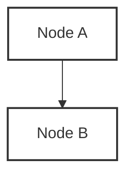

# 🤝 Contributing to Bullion Bank Research

First off, thank you for considering contributing! It's people like you that make this research project valuable.

---

## 📋 Code of Conduct

By participating in this project, you agree to abide by our [Code of Conduct](CODE_OF_CONDUCT.md). Please read it before contributing.

---

## 🧭 How Can I Contribute?

### 1. 🐛 Reporting Bugs

If you find a bug, please create an issue with:

- **Title**: Clear and descriptive.
- **Description**: Steps to reproduce, expected behavior, and actual behavior.
- **Environment**: OS, browser, version, etc.
- **Screenshots**: If applicable.

### 2. 💡 Suggesting Enhancements

We welcome new ideas! Please include:

- **Title**: Clear and descriptive.
- **Description**: What problem does this solve?
- **Benefits**: Why should we add this?
- **Alternatives**: Any other solutions you've considered.

### 3. 📝 Improving Documentation

Documentation improvements are always appreciated. This includes:

- Fixing typos or grammatical errors.
- Clarifying ambiguous explanations.
- Adding new sections or examples.
- Translating content.

### 4. 💻 Adding Code

We welcome code contributions! Please follow our development workflow.

---

## 🛠️ Development Workflow

### Step 1: Fork & Clone

```bash
# Fork the repository on GitHub, then clone your fork
git clone https://github.com/your-username/bullion-bank.git

cd bullion-bank

# Add upstream remote
git remote add upstream https://github.com/kongali1720/bullion-bank.git
```

### Step 2: Create a Branch

```bash
git checkout -b feature/your-feature-name
# or
git checkout -b fix/your-bug-fix
```

### Step 3: Make Changes

- Keep changes focused and atomic.
- Follow the existing code style.
- Update documentation if needed.
- Add tests if applicable.

### Step 4: Commit Changes

```bash
git add .
git commit -m "type: short description"

# Types:
# feat: New feature
# fix: Bug fix
# docs: Documentation changes
# style: Code style changes (formatting, etc.)
# refactor: Code refactoring
# perf: Performance improvements
# test: Adding or fixing tests
# chore: Maintenance tasks
```

### Step 5: Push & Create Pull Request

```bash
git push origin feature/your-feature-name
```

Then:

1. Go to the original repository on GitHub.
2. Click "New Pull Request".
3. Select your branch.
4. Fill in the PR template.
5. Submit the PR.

---

## 📝 Pull Request Guidelines

### PR Title

Follow conventional commits format:

```
feat: Add allocated gold account model
fix: Correct settlement calculation bug
docs: Update London market overview
```

### PR Description

Include:

- **What**: What does this PR do?
- **Why**: Why is this change needed?
- **How**: How did you implement it?
- **Testing**: How was it tested?
- **Screenshots**: If UI changes.

### Checklist

Before submitting a PR:

- [ ] I have read the [Code of Conduct](CODE_OF_CONDUCT.md).
- [ ] My code follows the project's style guidelines.
- [ ] I have added tests that prove my fix/feature works.
- [ ] I have updated documentation accordingly.
- [ ] My changes do not introduce breaking changes.
- [ ] I have verified my changes in a local environment.

---

## 🏗️ Project Structure

```
bullion-bank/
├── README.md           # Main documentation
├── LICENSE             # MIT License
├── SECURITY.md         # Security policy
├── CONTRIBUTING.md     # This file
├── CODE_OF_CONDUCT.md  # Code of conduct
├── docs/               # Documentation
├── diagrams/           # Mermaid diagrams
├── data/               # Research data
├── research/           # Methodology & references
└── security/           # Security models & risk analysis
```

---

## 📚 Style Guide

### Markdown

- Use `#` for titles (single `#` for main title).
- Use `##` for sections.
- Use `###` for subsections.
- Use backticks for inline code: `code`.
- Use triple backticks for code blocks with language specification.

### Mermaid Diagrams

- Use ` ```mermaid ` for diagrams.
- Define classes with `classDef`.
- Use descriptive node names.

Example:



### Data Files

- Use `.csv` or `.json` for structured data.
- Include headers and descriptions.
- Cite sources.

---

## 🧪 Testing

Before submitting, please test:

1. **Mermaid diagrams**: Verify they render correctly.
2. **Markdown rendering**: Ensure all formatting is correct.
3. **Links**: Check all links work.
4. **Spelling**: Run a spell checker.

---

## 📞 Questions?

If you have any questions, feel free to:

- Open a [Discussion](https://github.com/kongali1720/bullion-bank/discussions).
- Reach out via email: kongali@kongali1720.co.id

---

## 🌟 Recognition

Contributors will be:

- Acknowledged in the README.
- Credited in release notes.
- Mentioned in the contributors' section.

Thank you for making this project better! 🎉
