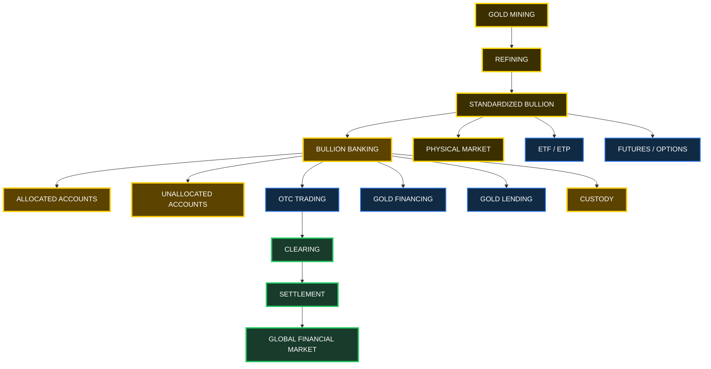
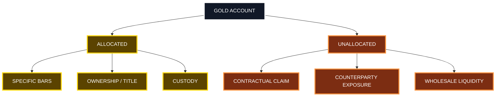
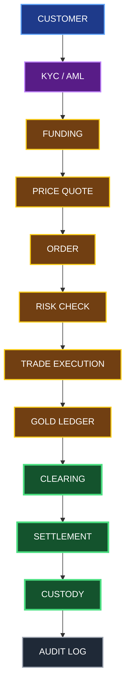
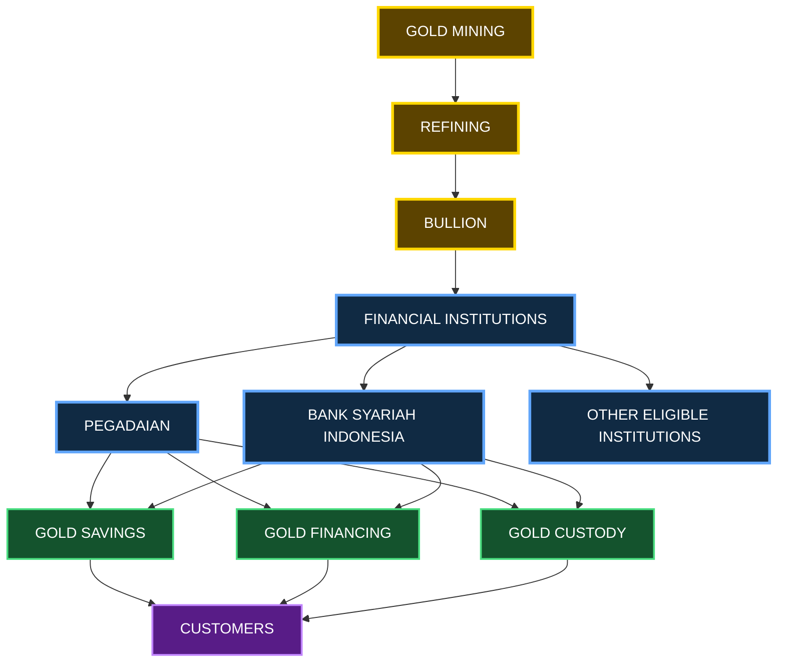
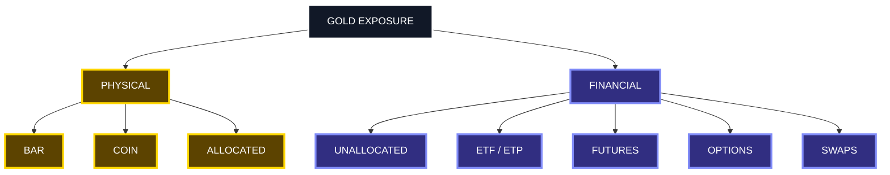
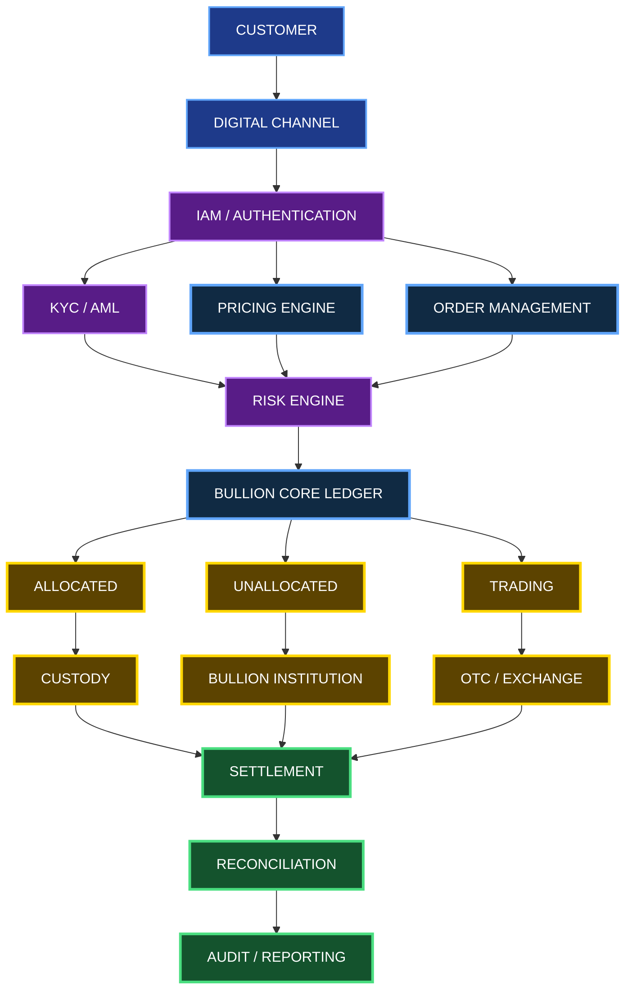
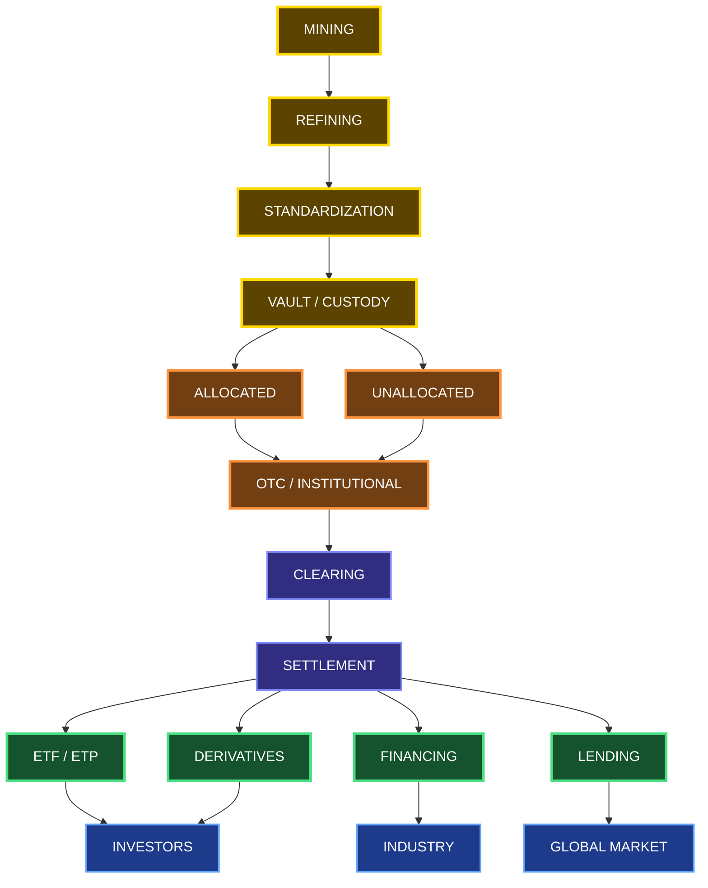
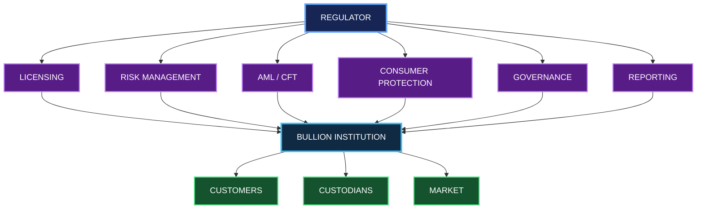

<p align="center">
  
</p>

<h1 align="center">🏦 BULLION BANK</h1>

<h2 align="center">
  From Physical Gold to Global Financial Infrastructure
</h2>

<p align="center">
  <b>Physical Gold • Allocated • Unallocated • OTC • Clearing • Settlement • Digital Gold</b>
</p>

<p align="center">
  
  
  
  
  
  
  
  
  
</p>

<p align="center">
  <b>🏦 BULLION BANK RESEARCH PROJECT</b><br>
  Physical Gold → Allocated → Unallocated → OTC → Clearing → Settlement → Digital Gold
</p>

---

# 🌍 Executive Summary

**Bullion banking** is the financial infrastructure that connects physical precious metals with global financial markets.

Modern gold markets are not limited to the physical buying and selling of gold bars. They combine multiple layers of physical, financial, technological, and regulatory infrastructure, including:

- Physical bullion
- Refining and standardization
- Allocated gold accounts
- Unallocated gold accounts
- OTC trading
- Futures and options
- Gold swaps
- Gold lending
- Gold financing
- Custody and vaulting
- Clearing
- Settlement
- Exchange-traded products
- Digital gold
- Tokenized gold

The central question of bullion banking is:

> **When someone owns "gold" through a financial institution, what exactly do they own?**

Depending on the product structure, the holder may have:

- Ownership associated with a specific physical bar
- A contractual claim to a quantity of gold
- Exposure through a financial product
- Exposure through a derivative
- A digital representation of an underlying asset

These structures may have very different legal, financial, operational, and counterparty characteristics.

---

# 🎯 Research Objectives

This repository is designed to provide a structured and technically detailed study of modern bullion banking.

### Primary Objectives

1. Explain the global bullion market.
2. Explain physical and financial gold structures.
3. Explain allocated and unallocated gold.
4. Explain OTC bullion trading.
5. Explain clearing and settlement.
6. Analyze counterparty and custody risk.
7. Examine Indonesia's bullion ecosystem.
8. Study digital gold infrastructure.
9. Study tokenized gold architecture.
10. Build an open research reference for developers, researchers, financial professionals, and students.

---

# 🧭 Core Principle

The most important principle in understanding bullion banking is:

> **Gold exposure is not necessarily the same thing as direct ownership of a specific gold bar.**

Every gold product should therefore be analyzed through at least six dimensions:

- Ownership
- Custody
- Counterparty
- Liquidity
- Settlement
- Legal title

Conceptually:

```
    OWNERSHIP
        +
    CUSTODY
        +
    COUNTERPARTY
        +
    LIQUIDITY
        +
    SETTLEMENT
        +
    LEGAL TITLE
```

---

# 🏗️ Global Gold Market Architecture



---

# 🪙 1. Physical Gold

Physical gold is the tangible underlying asset within the bullion ecosystem.

Examples include:

- London Good Delivery bars
- Kilobars
- Investment bars
- Coins
- Refinery products
- Industrial precious-metal products

A physical gold bar can have a defined identity and characteristics such as:

```
    Bar Number
    Refiner
    Gross Weight
    Fineness
    Fine Weight
    Assay Information
    Vault Location
    Custody Status
    Owner / Account Reference
```

---

# 📒 2. Allocated Gold

An **allocated gold account** generally associates the customer's ownership with specific bullion.

Conceptually:

```
    CUSTOMER
       |
       v
    ALLOCATED ACCOUNT
       |
       +---- BAR A001
       |
       +---- BAR A002
       |
       +---- BAR A003
```

Typical records can include:

| Field | Example |
|---|---|
| Bar ID | A001 |
| Refiner | Approved Refiner |
| Gross Weight | 400 oz |
| Fineness | 0.9999 |
| Fine Weight | 399.96 oz |
| Custodian | Approved Vault |
| Owner | Customer |

---

# 💳 3. Unallocated Gold

An **unallocated gold account** operates differently.

The customer generally does not own a specifically identified bar.

Instead, the customer has a contractual entitlement against the relevant institution for a quantity of precious metal.

Conceptually:

```
    CUSTOMER
       |
       v
    UNALLOCATED GOLD ACCOUNT
       |
       v
    CONTRACTUAL CLAIM
       |
       v
    BULLION INSTITUTION
       |
       +---- WHOLESALE MARKET
       +---- CLEARING
       +---- BULLION INVENTORY
```

The fundamental distinction is:

```
    ALLOCATED
        |
        +---- Specific bullion
        +---- Ownership / title
        +---- Custody

    UNALLOCATED
        |
        +---- Contractual claim
        +---- Counterparty exposure
        +---- Wholesale liquidity
```

---

# ⚠️ 4. Unallocated Gold Is Not Automatically "Fake Gold"

The phrase **"paper gold"** is frequently used in public discussions.

However, the term is imprecise unless the underlying instrument is defined.

A more useful question is:

> **What legal and economic claim does the account holder possess?**

Unallocated gold can be a legitimate financial-market instrument.

The important issues include:

- Counterparty exposure
- Contractual rights
- Liquidity
- Settlement terms
- Redemption terms
- Insolvency treatment
- Applicable law
- Institutional risk

---

# ⚖️ 5. Allocated vs Unallocated



---

# 🌐 6. London Bullion Market

London is one of the world's major wholesale bullion markets.

The **Loco London** concept is associated with bullion held within the London market infrastructure and transferred through account-based settlement.

The ecosystem can be represented conceptually as:

```
    MARKET MAKERS
          |
          v
    BULLION BANKS
          |
          v
    OTC DEALERS
          |
          v
       CLEARING
          |
          v
      SETTLEMENT
          |
          v
    CUSTODIANS / VAULTS
```

---

# 📊 7. Clearing Volume vs Physical Movement

A critical distinction is:

```
    TRADE VOLUME
          ≠
    CLEARING VOLUME
          ≠
    PHYSICAL GOLD MOVEMENT
```

Clearing can involve:

- Netting
- Account transfers
- Book-entry settlement
- Contractual settlement
- Offset positions

Therefore, large clearing volumes should not automatically be interpreted as equivalent quantities of physical gold being transported every day.

---

# 🔄 8. Gold Transaction Lifecycle



---

# 💰 9. Gold Financing

Gold can participate in financing structures involving:

- Mining companies
- Refiners
- Bullion dealers
- Banks
- Manufacturers
- Institutional investors

Conceptually:

```
    GOLD PRODUCER
          |
          v
    GOLD INVENTORY
          |
          v
    BULLION FINANCING
          |
          v
    WORKING CAPITAL
       /     |     \
      v      v      v
  PRODUCTION DISTRIBUTION INVENTORY
```

The economics depend on the relevant contractual and regulatory framework.

---

# 🔄 10. Gold Lending

Gold lending involves contractual arrangements under which bullion or metal exposure is made available to another party.

Conceptually:

```
    GOLD HOLDER
         |
         v
    BULLION BANK
         |
         v
    BORROWER
         |
         v
      MARKET
         |
         v
    CONTRACTUAL RETURN
         |
         v
    SETTLEMENT
```

Relevant considerations can include:

- Lease rate
- Collateral
- Maturity
- Counterparty
- Settlement
- Applicable law

---

# 📈 11. Gold Trading

Gold trading occurs through several market structures.

```
    OTC
     |
     +-- Spot
     +-- Forward
     +-- Swap
     +-- Options

    EXCHANGE
     |
     +-- Futures
     +-- Options

    PHYSICAL
     |
     +-- Bars
     +-- Coins
     +-- Jewellery
```

---

# 📉 12. Gold Derivatives

Gold derivatives can provide exposure to gold without requiring physical delivery for every transaction.

Examples include:

- Futures
- Forwards
- Options
- Swaps
- Structured products

Potential participants include:

```
    MINERS
       \
        \
    BANKS ----> HEDGING ----> GOLD DERIVATIVES
        /
       /
    INDUSTRIAL USERS
```

Investors can also use derivatives depending on the relevant market structure and eligibility.

---

# 🏛️ 13. Central Banks and Gold

Central banks may hold gold as part of reserve management.

Potential strategic objectives include:

- Reserve diversification
- Monetary confidence
- Crisis protection
- Geopolitical diversification
- Long-term reserve management

Conceptually:

```
    CENTRAL BANK
       |
       +---- FX RESERVES
       |
       +---- GOVERNMENT SECURITIES
       |
       +---- GOLD RESERVES
                    |
                    +---- CUSTODY
                    |
                    +---- RESERVE ASSET
```

---

# 📊 14. Gold ETFs / ETPs

Gold-backed exchange-traded products can provide market exposure through a financial-market structure.

Conceptually:

```
    INVESTOR
       |
       v
    ETF / ETP
       |
       v
    CUSTODIAN
       |
       v
      VAULT
       |
       v
    PHYSICAL GOLD
```

The exact ownership and redemption structure depends on the individual product.

---

# 🇮🇩 15. Indonesian Bullion Banking

Indonesia has developed a regulatory framework for bullion business activities.

A key reference is:

**OJK Regulation No. 17 of 2024 concerning Bullion Business Activities.**

The framework covers areas associated with bullion business activities, including:

- Gold savings
- Gold financing
- Gold trading
- Gold custody
- Other eligible bullion activities

The development of bullion services represents an important step toward building a domestic gold ecosystem.

---

# 🏦 16. Indonesian Gold Ecosystem



---

# 🏗️ 17. Indonesian Bullion Value Chain

```
    MINING
       |
       v
    REFINING
       |
       v
    STANDARDIZATION
       |
       v
    BULLION
       |
       v
    FINANCIAL INSTITUTION
       |
       +---- GOLD SAVINGS
       |
       +---- GOLD FINANCING
       |
       +---- GOLD CUSTODY
       |
       v
    MANUFACTURING
       |
       v
    DISTRIBUTION
       |
       v
    RETAIL
       |
       v
    CUSTOMER
```

The objective is not simply to sell gold.

The broader objective is to build an integrated financial ecosystem around precious metals.

---

# ⚖️ 18. London vs Indonesia

| Category | London Wholesale Market | Indonesia Bullion Ecosystem |
|---|---|---|
| Primary Role | Global wholesale liquidity | Domestic bullion ecosystem |
| Market Structure | Primarily OTC | Regulated domestic services |
| Accounts | Allocated / Unallocated | Product-specific |
| Clearing | London market infrastructure | Domestic financial infrastructure |
| Custody | Institutional vaults | Regulated custody |
| Financing | Wholesale structures | Regulated bullion financing |
| Gold Savings | Institutional structures | Consumer / banking products |
| Regulation | Relevant market and jurisdictional rules | OJK framework |
| AML / KYC | Required | Required |
| Consumer Protection | Jurisdiction dependent | Regulatory framework |

---

# 🔐 19. Counterparty Risk

Counterparty risk is one of the most important concepts in financial gold.

Conceptually:

```
    CUSTOMER
       |
       v
    INSTITUTION
       |
       v
    GOLD CLAIM
       |
       v
    COUNTERPARTY RISK
       |
       +---- CREDIT RISK
       |
       +---- LIQUIDITY RISK
       |
       +---- OPERATIONAL RISK
       |
       +---- LEGAL RISK
```

---

# ⚠️ 20. Bullion Risk Matrix

| Risk | Description |
|---|---|
| Counterparty Risk | Institution fails to meet contractual obligations |
| Market Risk | Gold price volatility |
| Liquidity Risk | Difficulty converting exposure into cash |
| Custody Risk | Failure or loss involving stored bullion |
| Operational Risk | System, process, or settlement failure |
| Cyber Risk | Unauthorized access or manipulation |
| Fraud Risk | False records or unauthorized transactions |
| Legal Risk | Ownership, title, or insolvency disputes |
| AML Risk | Illicit use of precious-metal systems |
| Settlement Risk | Failure to complete contractual settlement |

---

# 🔎 21. Physical Gold vs Financial Gold



---

# 🧮 22. Gold Exposure Matrix

| Instrument | Specific Bar | Contractual Exposure | Counterparty Exposure | Direct Custody |
|---|---:|---:|---:|---:|
| Physical Bar | Yes | Low | Limited | Yes |
| Allocated Gold | Yes | Limited | Exists | Yes |
| Unallocated Gold | No | Yes | Significant relevance | Institutional |
| Gold ETF / ETP | Product dependent | Yes | Product dependent | Custodian |
| Futures | No | Derivative | Clearing structure | No |
| Gold Option | No | Derivative | Yes | No |
| Gold Savings | Product dependent | Yes | Institution | Institution |

Physical ownership can still involve custody, operational, insurance, legal, and jurisdictional risks.

---

# 🧾 23. Bullion Core Ledger

A digital bullion platform requires a controlled ledger.

Potential fields include:

```
    Customer ID
    Account ID
    Metal
    Quantity
    Unit
    Account Type
    Transaction ID
    Trade ID
    Settlement ID
    Custodian
    Vault
    Status
    Timestamp
    Audit Hash
```

Example:

```json
    {
      "account_id": "GOLD-000001",
      "metal": "XAU",
      "quantity": "1000.000",
      "unit": "gram",
      "account_type": "allocated",
      "status": "active"
    }
```

---

# 🔄 24. Double-Entry Bullion Accounting

A production bullion platform should consider controlled accounting and reconciliation.

Example purchase:

```
    DEBIT
    Customer Cash / Settlement Account

    CREDIT
    Relevant Gold Position / Liability Account
```

Example sale:

```
    DEBIT
    Relevant Gold Position / Liability Account

    CREDIT
    Customer Cash / Settlement Account
```

Actual accounting treatment depends on:

- Legal structure
- Product design
- Accounting standards
- Institutional policies
- Regulatory requirements

---

# 🧱 25. Enterprise Bullion Architecture



---

# 🔐 26. Zero Trust Bullion Security

A modern bullion platform should not trust an internal network simply because a user or service is inside the organization.

Security architecture can include:

```
    USER
      |
      v
    MFA
      |
      v
    IAM
      |
      v
    RBAC / ABAC
      |
      v
    TRANSACTION AUTHORIZATION
      |
      v
    RISK ENGINE
      |
      v
    TRANSACTION SIGNING
      |
      v
    CORE LEDGER
      |
      +---- IMMUTABLE AUDIT LOG
      |
      +---- SIEM
      |
      +---- RECONCILIATION
```

---

# 🧮 27. Gold Reconciliation

A critical bullion control is reconciliation between multiple records.

```
    CUSTOMER LEDGER
           |
           v
    INTERNAL GOLD LEDGER
           |
           v
    CUSTODIAN RECORD
           |
           v
    VAULT INVENTORY
           |
           v
    PHYSICAL BAR DATA
```

For allocated systems, reconciliation can include individual bar-level records.

For unallocated systems, reconciliation may involve:

- Institutional liabilities
- Inventory
- Settlement positions
- Trading positions
- Contractual obligations
- Relevant controls

---

# 🔍 28. Proof-of-Reserve Concept

A digital gold ecosystem can implement a reserve-verification framework.

Conceptually:

```
    PHYSICAL GOLD
          |
          v
      CUSTODIAN
          |
          v
    INVENTORY RECORD
          |
          v
    INDEPENDENT ASSURANCE
          |
          v
      RESERVE REPORT
          |
          +---- CUSTOMERS
          |
          +---- REGULATORS
          |
          +---- MARKET
```

However:

> **Proof of reserves is not automatically equivalent to a complete financial audit.**

A complete assessment may also need to examine:

- Liabilities
- Legal title
- Encumbrances
- Related parties
- Insolvency treatment
- Custody arrangements
- Redemption rights

---

# ⛓️ 29. Tokenized Gold

Tokenization can introduce a blockchain settlement layer.

Conceptually:

```
    GOLD
      |
      v
    REFINER
      |
      v
    CUSTODIAN
      |
      v
    VERIFIED RESERVE
      |
      v
    GOLD LIABILITY LEDGER
      |
      v
    TOKENIZATION LAYER
      |
      v
    BLOCKCHAIN
      |
      v
    DIGITAL HOLDER
      |
      +---- TRANSFER
      |
      +---- REDEMPTION
                 |
                 v
              CUSTODIAN
```

Tokenization does not automatically prove:

- Physical ownership
- Legal title
- Reserve existence
- Custody
- Redemption
- Solvency

These must be established through the actual legal and operational structure.

---

# 🧠 30. Token Supply vs Physical Reserve

A robust tokenized-gold system should clearly define the relationship between:

```
    TOKEN SUPPLY
         |
         v
    GOLD LIABILITY
         |
         v
    CUSTODY RECORD
         |
         v
    PHYSICAL RESERVE
```

Example conceptual model:

```
    1 TOKEN
       |
       v
    Represents X grams of gold
       |
       v
    Under defined contractual terms
       |
       v
    Linked to specified reserve /
    custody structure
```

The exact legal relationship must be explicitly documented.

---

# 🌐 31. Global Gold Settlement Architecture


---

# 🌍 32. Complete Gold Lifecycle



---

# 🧩 33. Gold Market as a Multi-Layer System

```
    LAYER 1
    Physical Gold

          ↓

    LAYER 2
    Refining & Standardization

          ↓

    LAYER 3
    Vault & Custody

          ↓

    LAYER 4
    Allocated / Unallocated Accounts

          ↓

    LAYER 5
    OTC Trading

          ↓

    LAYER 6
    Clearing

          ↓

    LAYER 7
    Settlement

          ↓

    LAYER 8
    Financial Products

          ↓

    LAYER 9
    Digital / Tokenized Gold
```

Each layer introduces different:

- Legal rights
- Accounting treatment
- Operational processes
- Risks
- Liquidity characteristics
- Settlement mechanisms

---

# 📊 34. Key Market Metrics

The repository should distinguish carefully between different gold-market statistics.

| Metric | Interpretation |
|---|---|
| Gold Mine Production | New annual supply |
| Above-Ground Stock | Total accumulated gold |
| Trading Volume | Market activity |
| Clearing Volume | Cleared contractual obligations |
| Physical Delivery | Actual physical settlement |
| ETF Holdings | Gold held by relevant products |
| Central Bank Holdings | Official reserves |
| Futures Open Interest | Outstanding derivative positions |
| OTC Volume | Bilateral / dealer market activity |

These metrics should **not** be treated as interchangeable.

---

# 🔬 35. Research Methodology

This project follows a source hierarchy.

## Tier 1 — Primary Sources

    OJK
    LBMA
    World Gold Council
    Bank Indonesia
    BIS
    Official Exchange Publications
    Official Bank Disclosures
    Official Custodian Documents
    Applicable Regulations

## Tier 2 — Institutional / Academic Research

    Universities
    Research Institutions
    Central Bank Papers
    Peer-Reviewed Publications
    Industry Research

## Tier 3 — Secondary Sources

    Financial Media
    Industry Commentary
    Analyst Reports
    Educational Articles

Primary sources should be preferred whenever possible.

---

# 🔬 36. Research Questions

## Market Structure

- How does the global bullion market operate?
- How does OTC gold trading work?
- How does Loco London settlement work?

## Ownership

- What is allocated gold?
- What is unallocated gold?
- What legal rights does each structure provide?

## Risk

- What is counterparty risk?
- What is custody risk?
- What happens during institutional insolvency?

## Banking

- How does gold financing work?
- How does gold lending work?
- How do bullion institutions provide liquidity?

## Technology

- How can a bullion ledger be designed?
- How can reconciliation be automated?
- How can blockchain support auditability?

## Indonesia

- How does the Indonesian bullion regulatory framework operate?
- How can domestic gold supply be monetized?
- How can domestic gold financing develop?

---

# 🚨 37. Common Misconceptions

### Myth 1

> "Unallocated gold means fake gold."

**Reality:** Unallocated gold describes an account structure and contractual claim.

### Myth 2

> "Clearing volume means the same amount of physical gold moved."

**Reality:** Clearing can involve netting and book-entry settlement.

### Myth 3

> "Paper gold means there is no gold."

**Reality:** "Paper gold" is an informal term covering different financial structures.

### Myth 4

> "Tokenized gold automatically proves physical ownership."

**Reality:** Tokenization does not by itself establish legal title, custody, reserves, or redemption rights.

### Myth 5

> "Allocated gold has zero risk."

**Reality:** Allocated structures can still involve custody, legal, operational, insurance, and jurisdictional risks.

---

# 🏛️ 38. Regulatory Architecture



The regulatory layer may include:

```
    Licensing
          |
          +-- Governance
          |
          +-- Risk Management
          |
          +-- AML / CFT
          |
          +-- Consumer Protection
          |
          +-- Reporting
          |
          +-- Internal Controls
          |
          +-- Audit
```

---

# 🛡️ 39. Bullion Security Model

A modern bullion platform should protect:

```
    CUSTOMER DATA
         +
    GOLD BALANCES
         +
    TRANSACTION RECORDS
         +
    CUSTODY RECORDS
         +
    PRICING DATA
         +
    SETTLEMENT DATA
```

Security controls can include:

- Multi-factor authentication
- Role-based access control
- Transaction authorization
- Hardware-backed key management
- Encryption
- Network segmentation
- Fraud detection
- SIEM
- Immutable audit logging
- Continuous reconciliation
- Privileged-access management

---

# 🚀 40. Future Bullion Infrastructure

The future bullion ecosystem may combine:

```
    Traditional Bullion
            +
        Banking
            +
          APIs
            +
      Digital Ledger
            +
     Real-Time Pricing
            +
     AI Risk Analytics
            +
       Blockchain
            +
       Tokenization
            +
 Automated Reconciliation
            +
 Institutional Settlement
```

Conceptually:

```
    PHYSICAL GOLD
          |
          v
       CUSTODY
          |
          v
    DIGITAL LEDGER
          |
          +---- API
          |
          +---- PRICING
          |
          +---- RISK
          |
          +---- AML
          |
          +---- ANALYTICS
          |
          +---- BLOCKCHAIN
          |
          v
    TOKENIZED GOLD
          |
          v
     SETTLEMENT
```

---

# 🧠 41. The Fundamental Bullion Questions

Every gold product should answer:

    1. WHO owns the gold?

    2. WHAT exactly is owned?

    3. WHERE is the gold?

    4. WHO is the custodian?

    5. WHO is the counterparty?

    6. HOW is settlement performed?

    7. CAN physical redemption occur?

    8. WHAT happens if the institution fails?

    9. IS the reserve independently verified?

    10. WHAT LAW governs the relationship?

If these questions cannot be answered clearly, the structure requires additional due diligence.

---

# 🏁 42. Conclusion

Bullion banking represents the bridge between:

```
    PHYSICAL COMMODITY
            |
            v
      FINANCIAL ASSET
            |
            v
      GLOBAL LIQUIDITY
            |
            v
    DIGITAL INFRASTRUCTURE
```

The modern gold market is therefore not simply a market for buying and selling bars.

It is a multi-layer financial infrastructure involving:

```
    MINING
       |
       v
    REFINING
       |
       v
    BULLION
       |
       v
    CUSTODY
       |
       v
    ALLOCATED
       |
       v
    UNALLOCATED
       |
       v
    OTC
       |
       v
    CLEARING
       |
       v
    SETTLEMENT
       |
       v
    FINANCING
       |
       v
    LENDING
       |
       v
    ETF / ETP
       |
       v
    DERIVATIVES
       |
       v
    DIGITAL GOLD
       |
       v
    TOKENIZATION
```

The central distinction remains:

> **Physical gold, allocated gold, unallocated gold, ETFs, futures, derivatives, and tokenized gold are different structures with different legal and economic characteristics.**

Understanding these differences is essential for studying:

- Banking
- Commodities
- Financial infrastructure
- Gold markets
- Custody
- Settlement
- FinTech
- Digital assets
- Tokenization
- Risk management
- Financial regulation

---

# 🛠️ 43. Repository Roadmap


| Version | Focus |
|---|---|
| V1.0 | Global bullion market research |
| V1.1 | Allocated / unallocated account model |
| V1.2 | Counterparty and operational risk |
| V1.3 | Clearing and settlement |
| V1.4 | Digital bullion ledger |
| V1.5 | API architecture |
| V2.0 | Tokenized gold research |

---

# 📁 44. Recommended Repository Structure

```
    bullion-bank/
    │
    ├── README.md
    │
    ├── docs/
    │   ├── bullion-banking.md
    │   ├── allocated-gold.md
    │   ├── unallocated-gold.md
    │   ├── london-market.md
    │   ├── clearing.md
    │   ├── settlement.md
    │   ├── gold-financing.md
    │   ├── gold-lending.md
    │   ├── gold-derivatives.md
    │   ├── gold-etf.md
    │   ├── indonesia-bullion.md
    │   ├── tokenized-gold.md
    │   └── risk-management.md
    │
    ├── diagrams/
    │   ├── gold-market.mmd
    │   ├── bullion-bank.mmd
    │   ├── allocated-vs-unallocated.mmd
    │   ├── gold-clearing.mmd
    │   ├── gold-settlement.mmd
    │   ├── indonesia-bullion.mmd
    │   ├── digital-gold.mmd
    │   └── tokenized-gold.mmd
    │
    ├── data/
    │   ├── lbma/
    │   ├── wgc/
    │   ├── ojk/
    │   └── indonesia/
    │
    ├── research/
    │   ├── methodology.md
    │   ├── assumptions.md
    │   ├── glossary.md
    │   └── references.md
    │
    ├── security/
    │   ├── threat-model.md
    │   ├── custody-risk.md
    │   ├── counterparty-risk.md
    │   └── reconciliation.md
    │
    └── LICENSE
```

---

# 📚 45. Primary Reference Institutions

Recommended primary-source institutions include:

- London Bullion Market Association (LBMA)
- World Gold Council (WGC)
- Otoritas Jasa Keuangan (OJK)
- Bank Indonesia (BI)
- Bank for International Settlements (BIS)
- Relevant exchange operators
- Official bullion-bank disclosures
- Official custodian documentation
- Applicable financial regulations

Primary sources should be preferred whenever possible.

---

# 🤝 46. Contributing

Contributions are welcome.

Recommended workflow:

```bash
git clone https://github.com/kongali1720/bullion-bank.git

cd bullion-bank

git checkout -b feature/bullion-research

git add .

git commit -m "docs: expand bullion banking research"

git push origin feature/bullion-research
```

Before submitting a Pull Request:

- Verify factual claims
- Include primary sources
- Explain methodology
- Identify assumptions
- Separate facts from interpretation
- Test Mermaid diagrams
- Update documentation
- Avoid unsupported financial claims

---

# 📜 47. License

This project is released under the **MIT License**.

See:

```
    LICENSE
```

for details.

---

# ⚠️ 48. Disclaimer

This repository is intended for:

**Research, education, technical analysis, financial infrastructure studies, and open-source documentation.**

It is not:

- Investment advice
- Legal advice
- Banking advice
- A banking license
- A securities offering
- A gold investment solicitation
- A guarantee of physical gold ownership
- A guarantee of reserves
- A guarantee of redemption

Financial products should be evaluated according to their actual:

```
    CONTRACT
       +
    LEGAL STRUCTURE
       +
    CUSTODY
       +
    COUNTERPARTY
       +
    JURISDICTION
       +
    SETTLEMENT
       +
    REGULATORY FRAMEWORK
```

---

# ☕ Support the Project

If this research has helped your work in:

- Financial infrastructure
- Cybersecurity
- FinTech
- Blockchain
- Gold-market research
- Digital assets
- Open-source development

consider supporting continued development.

<p align="center">
  <a href="https://www.paypal.com/paypalme/bungtempong99">
    
  </a>
</p>

---

<h2 align="center">🏦 BULLION BANK RESEARCH</h2>

<p align="center">
  <b>Physical Gold → Allocated → Unallocated → OTC → Clearing → Settlement → Digital Gold</b>
</p>

<p align="center">
  <b>Research • Financial Infrastructure • Bullion Markets • FinTech • Security</b>
</p>

<p align="center">
  Built for open research and technical understanding of modern gold-market infrastructure.
</p>
